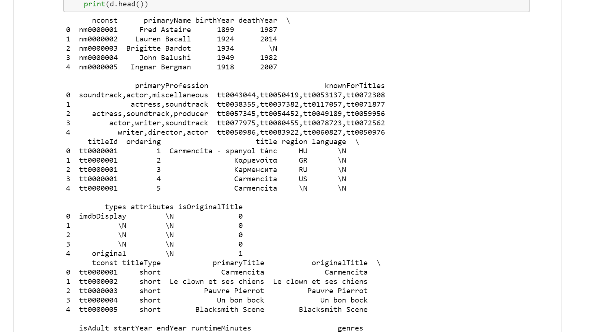
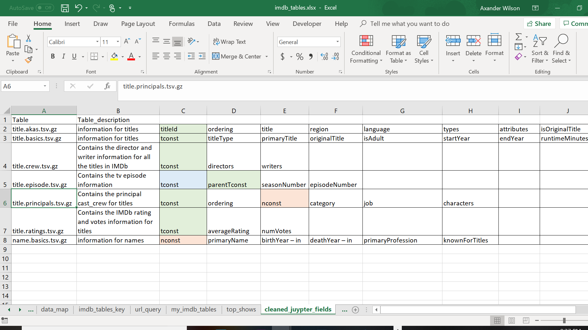
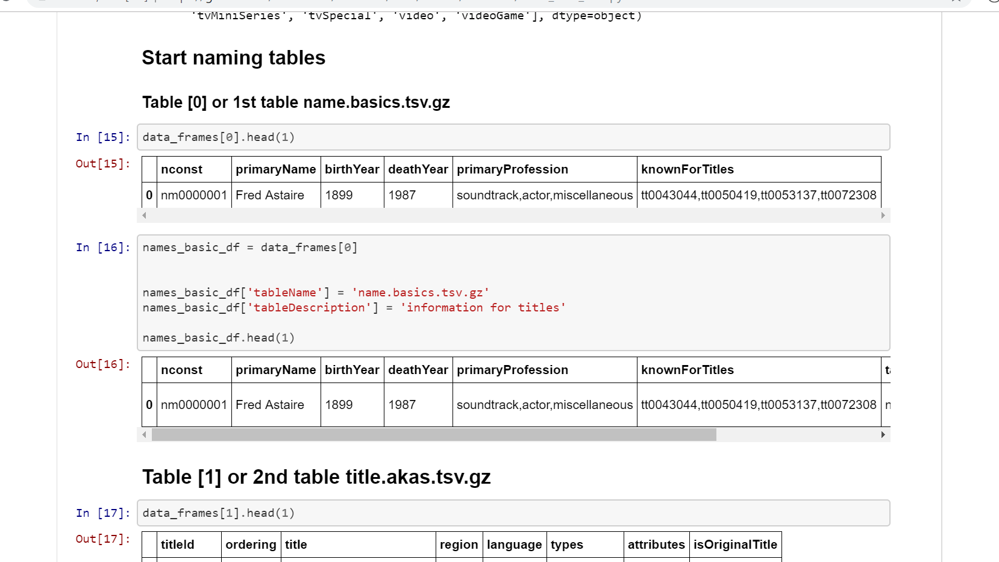

# IMDB

## Step 1: extraxt raw .tv.gz files from IMDB

---

## Step 2: Read documentation and study the dataset

---
## Step 3: Transform data and query data to determine relationships

---
## Step 4: Create database design and produce ER Diagram

---
## Step 5: Transform data and identify missing data points before loading data.