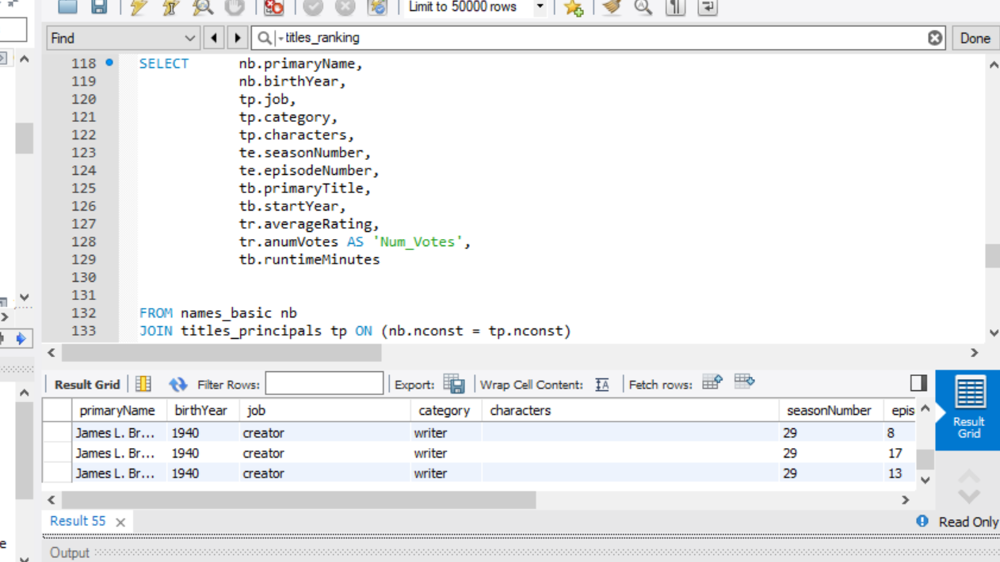
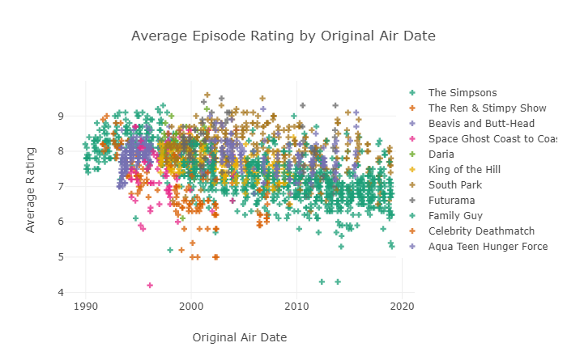
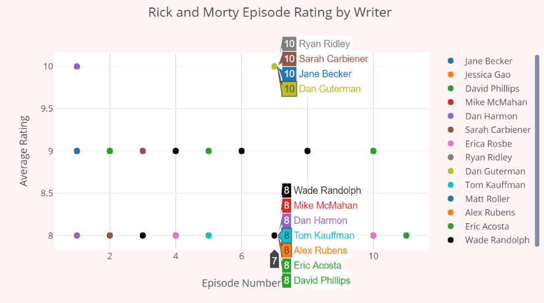

## Mining hidden gems located within  IMDB database to create data visualization models

---
### Sample Queries

---
## Sample data deep dive
---
### Hey, Axander build a report for ...

---
## Find some trends

---

## Dive deeper

---
## Writers seem important. Build a writer report

